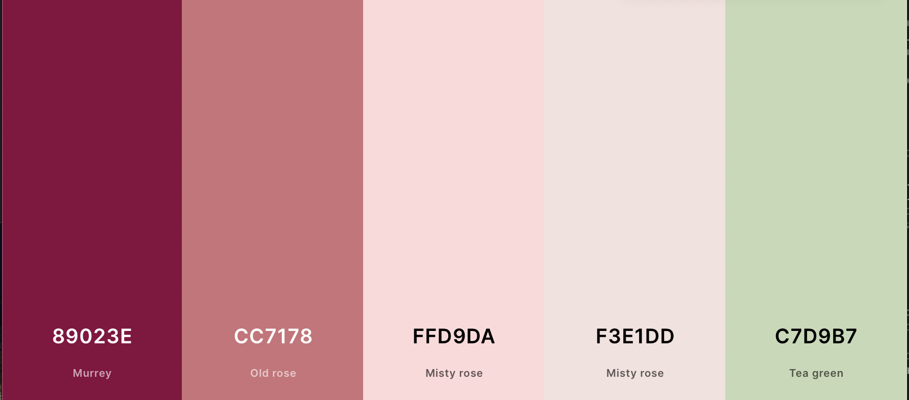
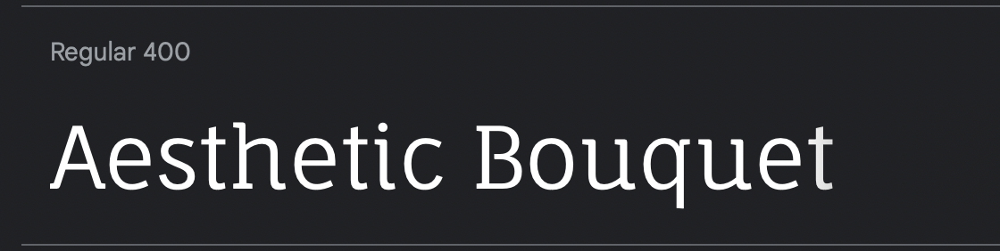
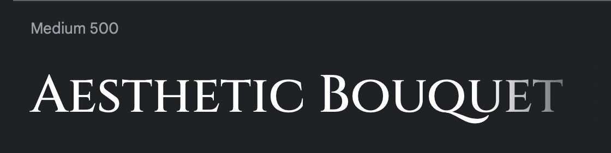

# Aesthetic Bouquet

Aesthetic Bouquet is a website that allows the user to browse through a gallery of bouquets for any occasion. it is not a full-fledged flower shop, as there is no possibility to order flowers online on this website.
The user can contact the company to order or if they have any questions.

The site can be accessed by this [link](https://github.com/AnastassiiaBondarenko/flowers/blob/main/index.html)

---

### First Time Visitor Goals:

* As a first-time visitor, I want to easily understand the main purpose of the site, to learn more about the organisation.
* As a first time visitor, I want to easily navigate the site to find the content I want.
* As a first time visitor, I want to see examples of flower bouquets to see if the organisation is trustworthy.

### Returning VisitorGoals:

* As a Returning Visitor, I want to see new examples of flowers.
* As a Returning Visitor, I want to find a way to contact the organization, so that I can ask additional questions or report any kind of problems.
* As a Returning Visitor, I want to find community links, so that I can learn more about the organization and find some reviews.

### Frequent Visitor Goals:
* As a Frequent User, I want to check whether there are any changes with flowers and bouquets, so I can make a choice which flower bunch I want to order.
* As a Frequent User, I want to have options for the reason to contact the company, so I can get an explicit answer to my email or by phone number. 
---

## Navigation

### Main navigation:

-  Home, Our Gallery, Contact Us.

### Home page

* The Home page tells a bit of information about our company and tries to interest the user by telling them about our advantages and why they should choose our company.

### Our Gallery

* Our Gallery page provides examples of our company's work to show the user the professionalism of our florists.
A wide variety of bouquets are shown, including wedding bouquets.
In the future, prices for each example bouquet may be added.

### Contact Us

* A contact us form is provided, where the user can leave a message with their questions or suggestions and the company will contact them in a short time. the user cannot place an order through this website, only to get to know our company.

* Phone number is optional for the comfort of users who prefer to get answers to their questions by email.

### Each page has a header with the name of the company,main picture and links to the 3 pages of the site. Also at the bottom of the each page has a footer with links to all possible social networks of the company.

### And when you hover your mouse over each link on this website the links change colour, this is designed for user convenience and understanding clickable links.
---
## Technologies Used

- [HTML](https://developer.mozilla.org/en-US/docs/Web/HTML) was used as the foundation of the site.
- [CSS](https://developer.mozilla.org/en-US/docs/Web/css) - was used to add the styles and layout of the site.
- [CSS Flexbox](https://developer.mozilla.org/en-US/docs/Learn/CSS/CSS_layout/Flexbox) - was used to arrange items simmetrically on the pages.
 
- [Balsamiq](https://balsamiq.com/) was used to make wireframes for the website.
- [VSCode](https://code.visualstudio.com/) was used as the main tool to write and edit code.
- [Git](https://git-scm.com/) was used for the version control of the website.
- [GitHub](https://github.com/) was used to host the code of the website.

---
## Design

### Color Scheme

- This site is designed in specific colours for a pleasant visual range. The colours match each other and the bouquets provided in our gallery.

### Wireframes

#### Desktop
- [Home Page. Desktop Screen](documentation/home_page.png)
- [Gallery Page. Desktop Screen](documentation/gallery_page.png)
- [Contact Page. Desktop Screen](documentation/contact_page.png)

### Typography

- Fauna One Google Font was used as the main font of the website in order to increase readability  of the content on the pages.

- Cinzel Google Font was used to draw users' attention to the company name and highlight the main headlines.

---
## Deployment

- The site has been deployed on GitHub pages. The deployment steps are as follows: 
  - In the [GitHub repository](https://github.com/AnastassiiaBondarenko/flowers), navigate to the Settings tab 
  - From the source section drop-down menu, select the **Main** Branch, then click "Save".
  - The page will automatically refresh with a detailed ribbon indicating the successful deployment.

The live link can be found [here](https://AnastassiiaBondarenko.github.io/flowers)

## Local Deployment

In order to create a local copy of this project, you can clone it.
In the IDE terminal, enter the following command to clone my repository:

- `git clone https://github.com/AnastassiiaBondarenko/flowers.git`

- Alternatively, if you use Gitpod, you can [click here](https://gitpod.io/#https://github.com/AnastassiiaBondarenko/flowers), which will start the Gitpod workspace for you.

---

## Testing

Please refer to the [TESTING.md](TESTING.md) file for all test-related documentation.

---

## Credits
+ #### Media 
  - All the images for the website were taken from [Unsplash](https://unsplash.com/).
  + [Header image](https://unsplash.com/photos/FHWgqOniOSY);
  + Home paige images:
    - [1st image](https://unsplash.com/photos/Uh1zTtFtGx8)
  + Gallery
    - [1st image](https://unsplash.com/photos/ID8y5fogYQ8)
    - [2nd image](https://unsplash.com/photos/hPcxvCecdPI)
    - [3rd image](https://unsplash.com/photos/xP0RKsjaY0U)
    - [4th image](https://unsplash.com/photos/oLyhygWW9n0)
    - [5th image](https://unsplash.com/photos/8_sWuFn8onY)
    - [6th image](https://unsplash.com/photos/JZDyFwGAEqY)
    - [7th image](https://unsplash.com/photos/295NLwGdrKM)
    - [8th image](https://unsplash.com/photos/eyi-0mlLCA0)
    - [9th image](https://unsplash.com/photos/NYIQd71qBqM)
    - [10th image](https://unsplash.com/photos/FngV7Tk6Lqg)
    - [11th image](https://unsplash.com/photos/1m-O865U6Go)
    - [12th image](https://unsplash.com/photos/x4YEK7o8L0c)

+ Contact Us:
  - [1st image](https://unsplash.com/photos/--OZtMyddAE)