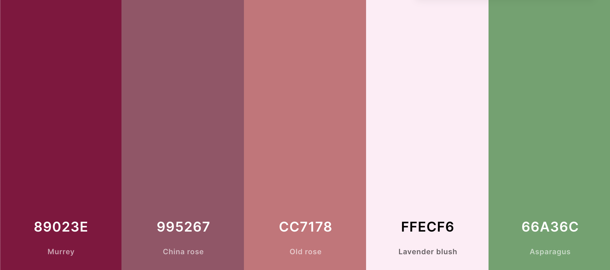

# Aesthetic Bouquet

Aesthetic Bouquet is a website that allows the user to browse through a gallery of bouquets for any occasion. it is not a full-fledged flower shop, as there is no possibility to order flowers online on this website.
The user can contact the company to order or if they have any questions.

The site can be accessed by this [link](https://github.com/AnastassiiaBondarenko/flowers/blob/main/index.html)

### First Time Visitor Goals:

* As a first-time visitor, I want to easily understand the main purpose of the site, to learn more about the organisation.
* As a first time visitor, I want to easily navigate the site to find the content I want.
* As a first time visitor, I want to see examples of flower bouquets to see if the organisation is trustworthy.

## Navigation

## Main navigation:

### Home, Our Gallery, Contact Us.

## Home paige

* The Home page tells a bit of information about our company and tries to interest the user by telling them about our advantages and why they should choose our company.

## Our Gallery

* Our Gallery paige provides examples of our company's work to show the user the professionalism of our florists.
A wide variety of bouquets are shown, including wedding bouquets.
In the future, prices for each example bouquet may be added.

## Contact Us

* A contact us form is provided, where the user can leave a message with their questions or suggestions and the company will contact them in a short time. the user cannot place an order through this website, only to get to know our company.

* Phone number is optional for the comfort of users who prefer to get answers to their questions by email.

### Each page has a header with the name of the company,main picture and links to the 3 pages of the site. Also at the bottom of the each page has a footer with links to all possible social networks of the company.

### And when you hover your mouse over each link on this website the links change colour, this is designed for user convenience and understanding clickable links.

## Design

### Color Scheme

- This site is designed in specific colours for a pleasant visual range. The colours match each other and the bouquets provided in our gallery.

### Typography

- Fauna One Google Font was used as the main font of the website in order to increase readability  of the content on the pages.

- Cinzel Google Font was used to draw users' attention to the company name and highlight the main headlines.

## Credits
+ #### Media 
  - All the images for the website were taken from [Unsplash](https://unsplash.com/).
  + [Header image](https://unsplash.com/photos/FHWgqOniOSY);
  + Home paige images:
    - [1st image](https://unsplash.com/photos/Uh1zTtFtGx8)
  + Gallery
    - [1st image](https://unsplash.com/photos/ID8y5fogYQ8)
    - [2nd image](https://unsplash.com/photos/hPcxvCecdPI)
    - [3rd image](https://unsplash.com/photos/xP0RKsjaY0U)
    - [4th image](https://unsplash.com/photos/oLyhygWW9n0)
    - [5th image](https://unsplash.com/photos/8_sWuFn8onY)
    - [6th image](https://unsplash.com/photos/JZDyFwGAEqY)
    - [7th image](https://unsplash.com/photos/295NLwGdrKM)
    - [8th image](https://unsplash.com/photos/eyi-0mlLCA0)
    - [9th image](https://unsplash.com/photos/NYIQd71qBqM)
    - [10th image](https://unsplash.com/photos/FngV7Tk6Lqg)
    - [11th image](https://unsplash.com/photos/1m-O865U6Go)
    - [12th image](https://unsplash.com/photos/x4YEK7o8L0c)