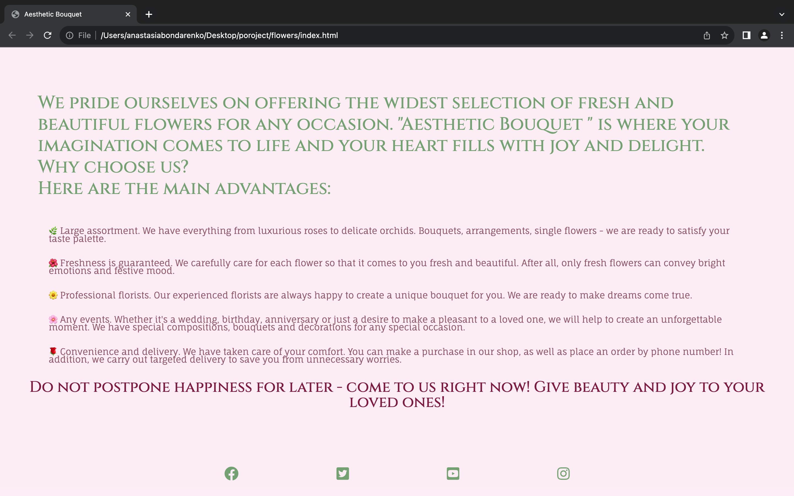
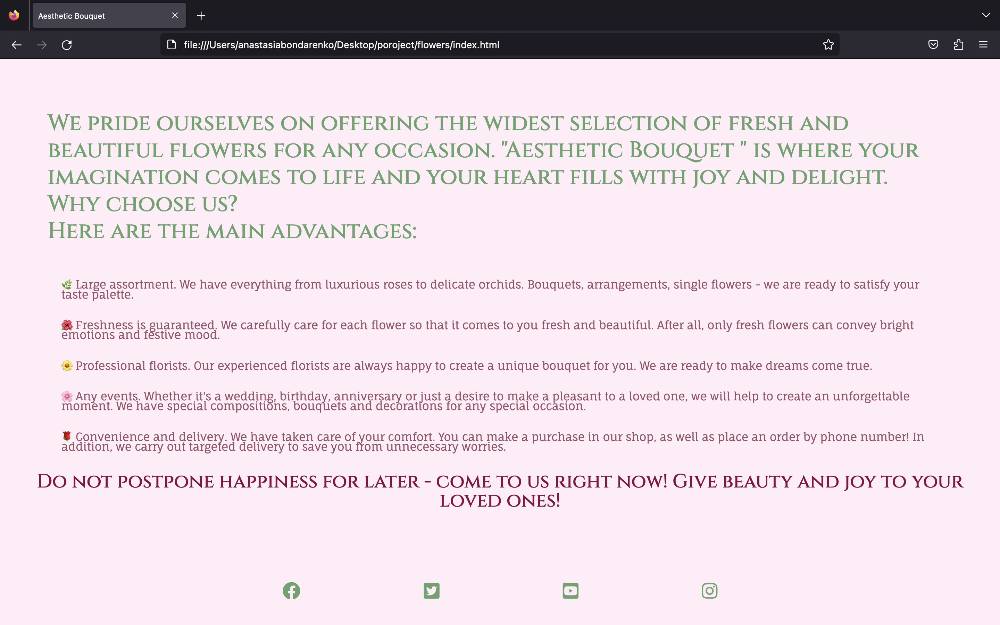
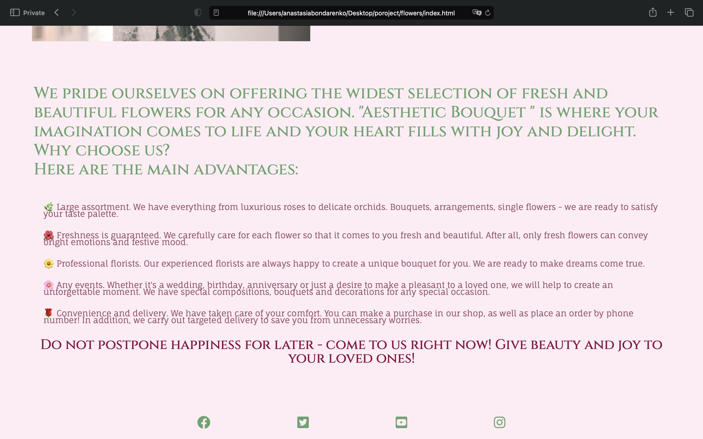
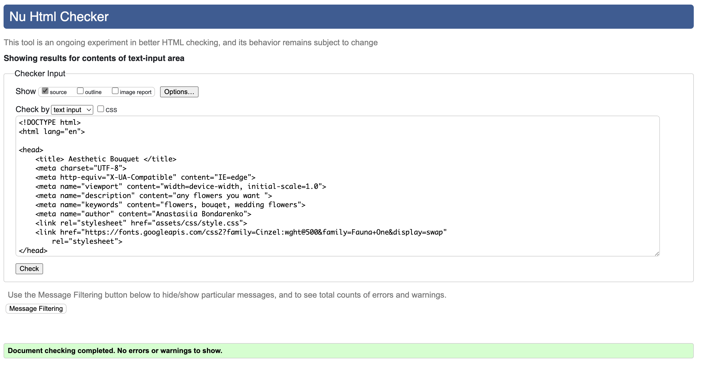
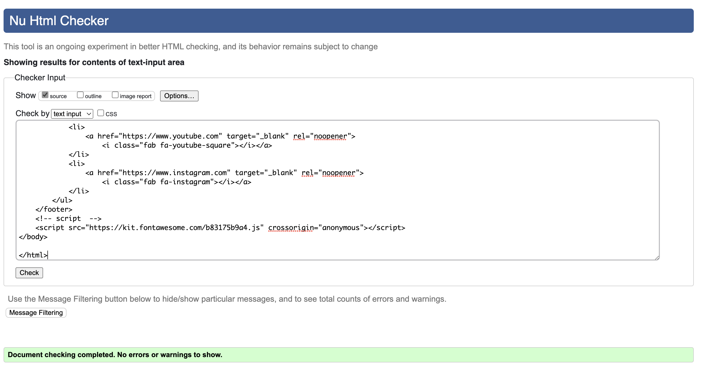
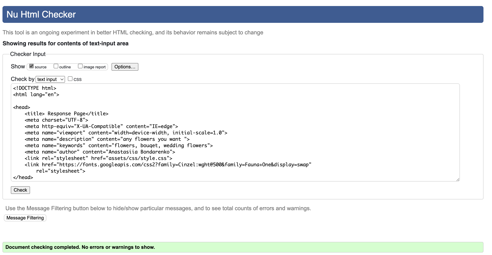
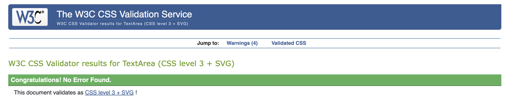
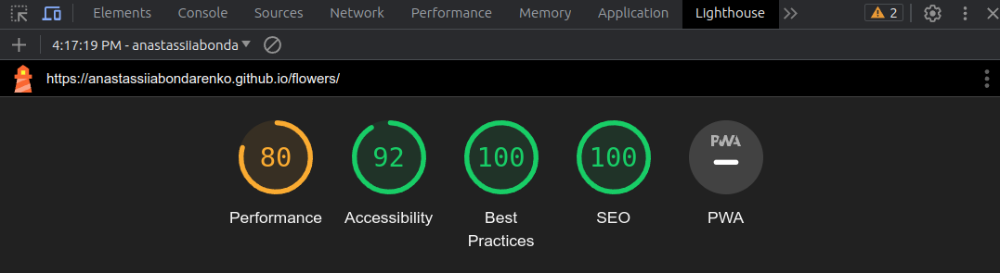
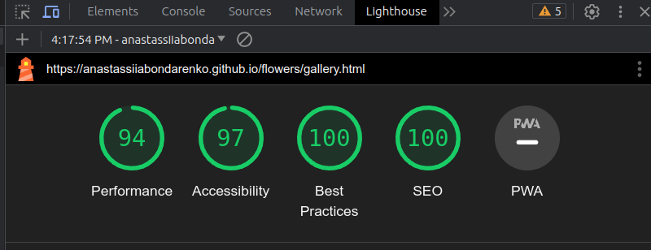
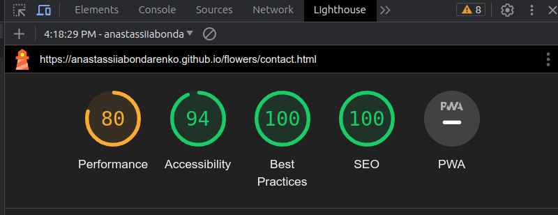

# TESTING

## Compatibility

To confirm correct functionality, responsiveness and appearance:

+ The site has been tested on the following browsers: Chrome, Firefox, Safari.

    - Chrome:

    
    
    - FireFox:

    
    

    - Safari:

    

    

---
## Responsiveness

+ Here's how the full pages of the website look like:
(checked with the GoFullSize extension in Chrome)

   - 

   - 

   - 

   - 

+ The website was checked with [Responsive Website Design Tester](https://responsivedesignchecker.com/).

- Desktop Screen:

 - Tablet Screen:

 

  - Mobile Screen:

  

+ The functionality of the links in the website was checked as well by different users.

## Manual testing

| feature | action | expected result | tested | passed | comments |
| --- | --- | --- | --- | --- | --- |
| Navbar | | | | | |
| Home | Click on the "Home" link | The user is redirected to the main page | Yes | Yes | - |
| Gallery | Click on the "Gallery" link | The user is redirected to the gallery page | Yes | Yes | - |
| Contact | Click on the "Contact" link | The user is redirected to the contact page | Yes | Yes | - |
| Footer | | | | | |
| Instagram icon in the footer | Click on the Instagram icon | The user is redirected to the Instagram page | Yes | Yes | - |
| Facebook icon in the footer | Click on the Facebook icon | The user is redirected to the Facebook page | Yes | Yes | - |
| Twitter icon in the footer | Click on the Twitter icon | The user is redirected to the Twitter page | Yes | Yes | - |
| YouTube icon in the footer | Click on the YouTube icon | The user is redirected to the YouTube page | Yes | Yes | - |
| Home page | | | | | |
| "Contact Us" button in Header | Click on the "Contact Us" button | The user is redirected to the contact page | Yes | Yes | - |
| Gallery page | | | | | |
| "Contact Us" button in header  | Click on the "Contact Us" button | The user is redirected to the contact page | Yes | Yes | - |
| "Contact Us" button in Call to action section | Click on the "Contact Us" button | The user is redirected to the contact page | Yes | Yes | - |
| Contact page | | | | | |
| First name input | Enter the first name | The first name is entered | Yes | Yes | If user doesn't enter the first name, the error message appears |
| Last name input | Enter the last name | The last name is entered | Yes | Yes | If user doesn't enter the last name, the error message appears |
| Email input | Enter the email | The email is entered | Yes | Yes | If user doesn't enter the email, the error message appears. If user enters not valid email, the error message appears |
| Phone number input | Enter the phone number | Phone number is entered (or not)  |Yes | Yes | If user doesn't enter the number would be no error mesage 
| "Submit" button | Click on the "Submit" button | The user is redirected to the response page | Yes | Yes | - |
| Response page | | | | | |
| Response message | The user will be automatically redirected to the home page after 10 seconds | The user is redirected to the home page | Yes | Yes | - |

---
## Validator testing
+ ### HTML
  #### Home Page
    - No errors or warnings were detected when passing through the official W3C validator.

       
    
  #### Gallery Page
   - No errors or warnings were detected when passing through the official W3C validator.

    

  #### Contact Page
    - No errors or warnings were detected when passing through the official W3C validator.

    

  #### Response Page
    - No errors or warnings were detected when passing through the official W3C validator.

    
    
+ ### CSS

 - No errors or warnings were found when passing through the official W3C (Jigsaw) validator.
    
    

+ ## LightHouse report

    - Using lighthouse in devtools, I made sure the site works well, is accessible, and the colors and fonts chosen are readable.
    
  ### Home page

 ### Gallery page

 ### Contact page

---
​
## Bugs
+ ### Solved bugs
    1. In Contact Us page I accidentally put type-text in the email form.
  *Solutions:* Fixed to type-email.
    2. I used a container several times when I didn't need it. 
    *Solution:* remove unnecessary containers.
    3. Used float and margin, which made the page deform when resizing. 
    *Solution:* almost all float and margin were replaced, which made the page more responsive.

 ---
+ ### Unsolved bugs
    - When I commit it's like it's not in my name, but I can't do anything about that unfortunately.
    ---